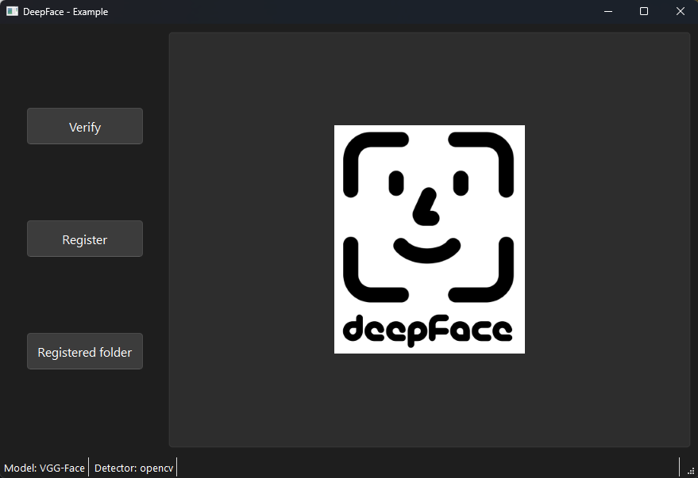

# Implementace

Pro demonstraci využití knihovny jsem vytvořil jednoduchý program, který umožňuje rozpoznat tváře a zaregistrovat tváře do databáze přes webkameru.

Aplikace neklade důraz na UI/UX, ale spíše na demo funkcionalitu knihovny.

Screenshot aplikace:

## Ovládání

Aplikace obsahuje 3 tlačítka:

- **Verify** 
  - Spustí webkameru a umožní ověřit tváře na základě databáze tváří. 
  - Backend začne analyzovat každý snímek z kamery a snaží se na něm najít tváře. Zvýraznění tváře obdelníkem znamená, že na snímku byla rozeznána tvář. Pokud nalezne aspoň 30 tváří (nastavený defaultní threshold), tak se pokusí pomocí vybraného modelu porovnat tváře s databází tváří. 
  - Pokud nalezne shodu, tak se snímání vypne a zobrazí se výsledek (Identita, Distance, Threshold) a v posledním snímku se zvýrazní nalezená tvář s identitou.
  - Pokud se shoda nenalezne, tak se zobrazí ve StatusBaru "No identity found." a snímání znovu pokračuje s nulovým thresholdem pro nalezání tváří.
  - Verifikaci můžeme manuálně zastavit pomocí stejného tlačítka.

- **Register** 
  - Spustí webkameru a umožní zaregistrovat tvář do databáze tváří.
  - Po spuštění webkamery lze pomocí tlačítka "Take picture" vyfotit tvář. Po vyfocení se zobrazí výsledek a je povolí se tlačítko "Register picture". Po kliknutí na tlačítko uživatel může vybrat pod jakou identitou má být tvář zaregistrována, případně vytvořit novou identitu.
  - Pokud se snímek nevydaří, tak je možné ho vyfotit znovu pomocí tlačítka "Retake picture".

- **Registered folder** - Otevře složku databáze s registrovanými tvářemi.
